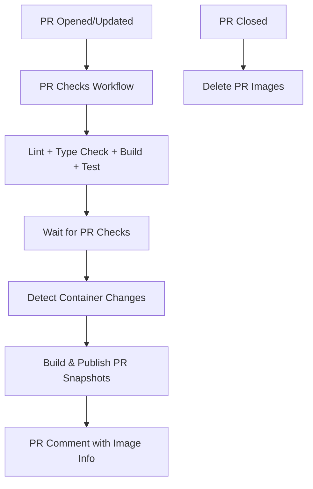

# CI/CD Pipeline Optimization - Consolidated Docker Build & Publish

## Overview

This document describes the optimization of our CI/CD pipeline to eliminate redundant Docker image builds. The previous two-phase process has been consolidated into a single, efficient workflow.

## Previous Architecture (Inefficient)

### ❌ Old Process - Redundant Builds
1. **PR Checks** (`pr-checks.yml`) → Build Docker images for validation (not published)
2. **Docker Publish** (`docker-publish.yml`) → Build the same images again and publish as snapshots

**Problem**: Same Docker images built twice, wasting CI resources and time.

## New Architecture (Optimized)

### ✅ New Process - Single Build & Publish
1. **PR Checks** (`pr-checks.yml`) → Run code quality checks (lint, type-check, build, test)
2. **Docker Build & Publish** (`docker-publish.yml`) → Wait for PR checks, then build once and publish snapshots

**Benefits**: 
- 50% reduction in Docker build time
- Single source of truth for image validation
- Reduced CI resource consumption
- Faster feedback loop

## Workflow Details

### 1. PR Checks Workflow (`pr-checks.yml`)

**Purpose**: Code quality validation
**Triggers**: PR opened, synchronized, reopened
**Jobs**:
- 🔍 Detect container changes (path-based optimization)
- 🔍 ESLint code quality checks
- 🔍 TypeScript type verification  
- 🔨 TypeScript project build
- 🧪 Jest unit tests

**Key Change**: Removed redundant `docker-build` job

### 2. Docker Build & Publish Workflow (`docker-publish.yml`)

**Purpose**: Build validation + snapshot publishing
**Triggers**: PR opened, synchronized, reopened, closed
**Jobs**:

#### Build & Publish Phase
- ⏳ **Wait for PR Checks** - Ensures code quality before building
- 🔍 **Detect Container Changes** - Path-based optimization
- 🐳 **Build & Publish PR Snapshot** - Single step for validation + publishing

#### Cleanup Phase  
- 🗑️ **Delete PR Images** - Automatic cleanup when PR closes

## Path-Based Optimization

The pipeline intelligently builds only affected containers:

### Trigger Conditions
- **Shared changes** → Build all containers (`bunkbot`, `djcova`, `starbunk-dnd`, `covabot`)
- **Individual container changes** → Build only affected container
- **Root file changes** → Build all containers
- **Workflow changes** → Build all containers
- **Docker file changes** → Build all containers

### Path Filters
```yaml
shared: 'containers/shared/**'
bunkbot: 'containers/bunkbot/**'
djcova: 'containers/djcova/**'
starbunk-dnd: 'containers/starbunk-dnd/**'
covabot: 'containers/covabot/**'
root-files: ['package.json', 'package-lock.json', 'tsconfig.json', '.eslintrc.json', 'jest.config.js']
workflows: '.github/workflows/**'
docker: ['Dockerfile*', '.dockerignore', 'docker-compose*.yml']
```

## Image Naming & Registry

### Container Images
- **Registry**: GitHub Container Registry (GHCR)
- **Format**: `ghcr.io/andrewgari/{container}:pr-{number}-snapshot`
- **Examples**:
  - `ghcr.io/andrewgari/bunkbot:pr-123-snapshot`
  - `ghcr.io/andrewgari/djcova:pr-123-snapshot`
  - `ghcr.io/andrewgari/starbunk-dnd:pr-123-snapshot`
  - `ghcr.io/andrewgari/covabot:pr-123-snapshot`

### Image Lifecycle
1. **Creation**: Built and published when PR is opened/updated
2. **Updates**: In-place replacement on PR commits (same tag)
3. **Cleanup**: Automatically deleted when PR is closed

## Dependency Chain



## Quality Gates

### Before Docker Build
All these checks must pass before Docker images are built:
- ✅ ESLint code quality checks
- ✅ TypeScript type verification
- ✅ TypeScript project build
- ✅ Jest unit tests

### Build Validation
- Docker build success serves as container validation
- Failed builds prevent image publishing
- Build cache optimization for faster subsequent builds

## PR Integration

### Automated Comments
When images are successfully built and published, the workflow automatically:
- Comments on the PR with image details
- Provides pull commands for testing
- Updates existing comments on subsequent builds
- Indicates build validation status

### Example PR Comment
```
🐳 **Docker Image Built & Published for `bunkbot`**

**Image:** `ghcr.io/andrewgari/bunkbot:pr-123-snapshot`
**Pull Command:** `docker pull ghcr.io/andrewgari/bunkbot:pr-123-snapshot`

✅ **Build Validation:** This image was built after all PR checks passed, serving as both build validation and snapshot artifact.
📝 **Note:** This image uses a predictable name that gets updated with each PR commit.
🗑️ **Cleanup:** Image will be automatically deleted when the PR is closed.
```

## Testing with Snapshot Images

### Using Docker Compose
```bash
# Set PR number and test with snapshots
export PR_NUMBER=123
docker-compose -f docker-compose.snapshot.yml up -d

# Or with Podman
podman-compose -f podman-compose.snapshot.yml up -d
```

### Manual Testing
```bash
# Pull specific container snapshot
docker pull ghcr.io/andrewgari/bunkbot:pr-123-snapshot

# Run for testing
docker run -d --name test-bunkbot \
  -e STARBUNK_TOKEN=your_token \
  ghcr.io/andrewgari/bunkbot:pr-123-snapshot
```

## Performance Improvements

### Build Time Reduction
- **Before**: ~10-15 minutes (2 builds per container)
- **After**: ~5-8 minutes (1 build per container)
- **Savings**: 40-50% reduction in build time

### Resource Optimization
- Reduced GitHub Actions minutes consumption
- Better cache utilization with single build path
- Eliminated redundant layer downloads

### Developer Experience
- Faster PR feedback
- Single source of truth for build validation
- Clearer workflow progression
- Automatic cleanup reduces registry bloat

## Monitoring & Troubleshooting

### Workflow Status
Monitor workflow status in GitHub Actions:
- PR Checks: Code quality validation
- Docker Build & Publish: Image creation and publishing

### Common Issues
1. **Build Failures**: Check PR checks first, then Docker build logs
2. **Image Not Found**: Verify PR number and container name
3. **Cleanup Issues**: Manual cleanup may be needed for failed workflows

### Manual Cleanup
If automatic cleanup fails:
```bash
# List packages
gh api /user/packages?package_type=container

# Delete specific version
gh api -X DELETE /user/packages/container/{package_name}/versions/{version_id}
```

## Migration Impact

### For Developers
- No changes to development workflow
- Same PR process and testing procedures
- Faster CI feedback

### For Operations
- Reduced CI resource consumption
- Simplified workflow monitoring
- Consistent image naming and lifecycle

## Future Enhancements

### Potential Optimizations
1. **Multi-architecture builds** for ARM64 support
2. **Build matrix optimization** for parallel container builds
3. **Advanced caching strategies** for even faster builds
4. **Integration testing** with snapshot images

### Monitoring Additions
1. **Build time metrics** tracking
2. **Resource usage monitoring**
3. **Success rate analytics**
4. **Cache hit rate optimization**
