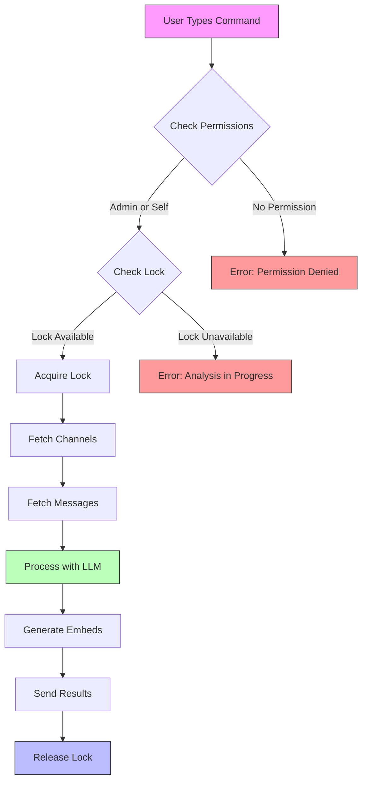
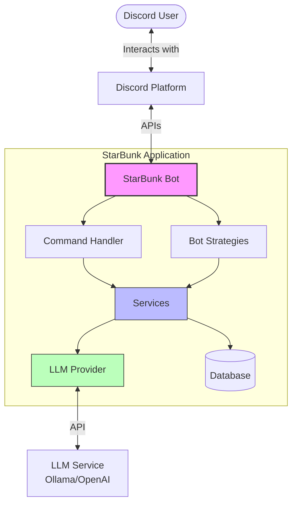
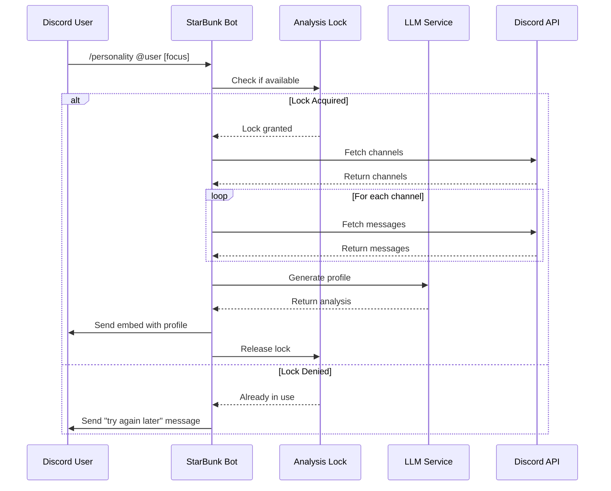
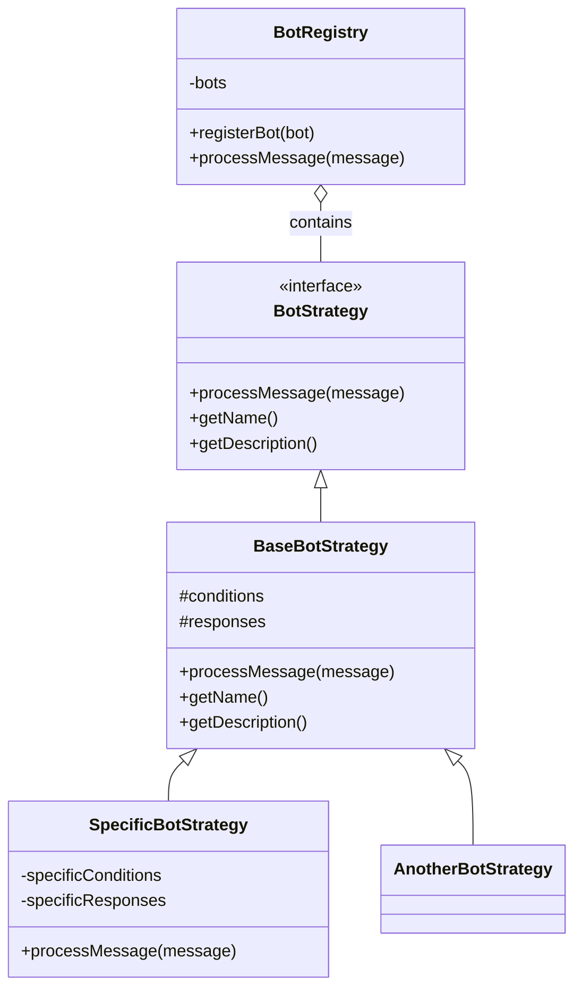
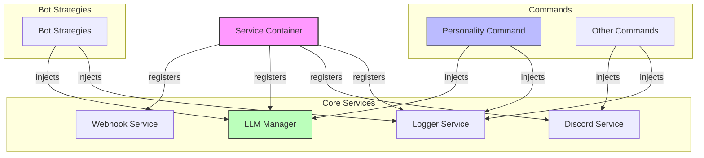

# StarBunk Discord Bot

A sophisticated Discord bot built with TypeScript that combines personality-driven bots, community management tools, and advanced LLM-powered analysis capabilities.

## 🌟 Key Features

### 🤖 Personality Bots
- **Multiple Bot Personas**: Includes various themed bots that react to messages based on unique trigger patterns
- **Strategy Pattern**: Each bot implements a consistent interface but with unique behaviors
- **Dynamic Loading**: Bots are loaded at runtime from their respective directories

### 🧠 LLM Integration
- **Personality Analysis Command**: Generate detailed profiles of users based on their message history
- **Custom Focus Areas**: Analyze specific aspects of users' communication and skills
- **Concurrent Request Limiting**: Prevents system overload with a locking mechanism

### 🛠️ Command System
- **Slash Commands**: Modern Discord interaction patterns
- **Role-Based Permissions**: Commands restricted by user roles
- **Command Categories**: Organized by functionality

### 📊 Technical Features
- **Dependency Injection**: Service container for better testability and modularity
- **Type Safety**: Full TypeScript implementation with strict typing
- **Repository Pattern**: Data access abstraction for different storage mechanisms

## 📋 Commands

### `/personality @user [focus]`
Analyzes a user's message history to create a comprehensive personality profile.

**Parameters:**
- `@user`: The user to analyze (required)
- `focus`: Optional custom focus area for the analysis (e.g., "programming skills", "communication style")

**Permissions:**
- Users can only analyze themselves
- Administrators can analyze any user
- Only one analysis can run at a time

**Example Usage:**
```
/personality @JohnDoe
/personality @JaneDoe focus:technical skills
```

**Command Flow:**


## 🚀 Development

### Prerequisites
- Node.js 16.x or higher
- Discord Bot Token
- LLM provider access (Ollama or OpenAI)

### Setup
1. Clone the repository:
```bash
git clone https://github.com/yourusername/starbunk-js.git
cd starbunk-js
```

2. Install dependencies:
```bash
npm install
```

3. Create a `.env` file with your credentials:
```
STARBUNK_TOKEN=your_discord_bot_token
CLIENT_ID=your_discord_client_id
GUILD_ID=your_discord_server_id
OPENAI_API_KEY=your_openai_api_key # Optional
OLLAMA_API_URL=http://localhost:11434 # For local Ollama
```

4. Start the development server:
```bash
npm run dev
```

### Key NPM Commands
- `npm run build`: Compile TypeScript
- `npm run dev`: Start development server
- `npm run lint`: Run ESLint
- `npm run check:all`: Run all checks (lint, typecheck, tests, build)
- `npm test`: Run Jest tests

## 📁 Project Structure

```
src/
├── bunkbot.ts                # Main entry point
├── config.ts                 # Configuration loader
├── discord/                  # Discord-specific utilities
├── domain/                   # Domain models
├── infrastructure/           # Data access and repositories
├── services/                 # Core application services
│   ├── llm/                  # LLM integration 
│   └── bootstrap.ts          # Service initialization
├── starbunk/                 # Bot-specific code
│   ├── bots/                 # Bot strategies
│   ├── commands/             # Command implementations
│   └── starbunkClient.ts     # Discord client wrapper
└── utils/                    # Utility functions
```

## 📊 Architecture Diagrams

### System Architecture



### Personality Analysis Sequence



### Bot Strategy Pattern



## 🧪 Testing

The codebase uses Jest for testing. Run the tests with:

```bash
npm test
```

To run specific tests:

```bash
npx jest path/to/specific/test.test.ts
```

## 🔐 Permissions

For the `/personality` command:
- Regular users can only analyze their own messages
- Users with Administrator permission can analyze any user
- All analysis results are only visible to the requesting user
- Only one analysis can run at a time (lock system)

## 🧩 Dependency Injection

StarBunk uses a service container for dependency injection, making the code more modular and testable.



## 📜 License

This project is licensed under the MIT License - see the LICENSE file for details.

## 🙏 Acknowledgments

- Discord.js team for their excellent library
- Ollama and OpenAI for LLM capabilities
- All contributors to the project