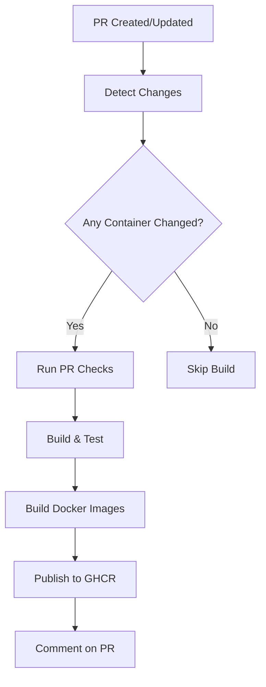
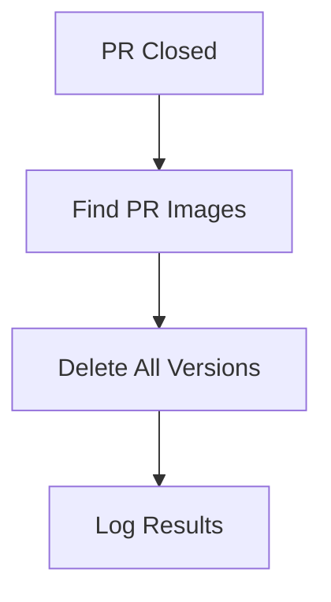

# CI/CD Pipeline Setup - PR Docker Images

## Overview

The CI/CD pipeline has been fixed and enhanced to properly create, publish, and clean up temporary Docker images for pull requests. This enables testing of containerized applications before merging changes.

## What Was Fixed

### 1. **Docker Image Publishing** (`docker-publish.yml`)
- ✅ **Fixed Authentication**: Now uses `GITHUB_TOKEN` instead of `GHCR_PAT`
- ✅ **Enhanced Tagging**: Uses metadata action for better image labeling
- ✅ **PR Comments**: Automatically comments on PRs with image pull commands
- ✅ **Error Handling**: Continues building other containers if one fails
- ✅ **Platform Support**: Builds for `linux/amd64` platform

### 2. **PR Cleanup** (`pr-cleanup.yml`)
- ✅ **Complete Cleanup**: Removes all container images for a PR
- ✅ **Better Error Handling**: Handles missing packages gracefully
- ✅ **Detailed Logging**: Provides comprehensive cleanup logs
- ✅ **Multi-Container Support**: Cleans up all 4 container types

### 3. **Workflow Integration**
- ✅ **Path-Based Optimization**: Only builds changed containers
- ✅ **Smart Dependencies**: Shared changes trigger all container builds
- ✅ **Proper Permissions**: Configured correct GitHub permissions
- ✅ **Validation**: Added workflow validation script

## How It Works

### PR Creation/Update Flow


### PR Closure Flow


## Container Images

### Image Naming Convention
- **Format**: `ghcr.io/andrewgari/starbunk-js/{container}:pr-{number}`
- **Examples**:
  - `ghcr.io/andrewgari/starbunk-js/bunkbot:pr-123`
  - `ghcr.io/andrewgari/starbunk-js/djcova:pr-123`
  - `ghcr.io/andrewgari/starbunk-js/starbunk-dnd:pr-123`
  - `ghcr.io/andrewgari/starbunk-js/covabot:pr-123`

### Supported Containers
1. **BunkBot**: Reply bots and admin commands
2. **DJCova**: Music service (Discord voice)
3. **Starbunk-DND**: D&D features with LLM integration
4. **CovaBot**: AI personality bot

## Usage Examples

### Testing a PR Locally
```bash
# Pull the PR image
docker pull ghcr.io/andrewgari/starbunk-js/bunkbot:pr-123

# Run with environment variables
docker run -d \
  --name test-bunkbot \
  -e STARBUNK_TOKEN=your_token \
  -e DATABASE_URL=your_db_url \
  ghcr.io/andrewgari/starbunk-js/bunkbot:pr-123

# Check logs
docker logs test-bunkbot

# Cleanup
docker stop test-bunkbot && docker rm test-bunkbot
```

### Using Docker Compose with PR Images
```yaml
# docker-compose.pr.yml
version: '3.8'
services:
  bunkbot:
    image: ghcr.io/andrewgari/starbunk-js/bunkbot:pr-123
    environment:
      - STARBUNK_TOKEN=${STARBUNK_TOKEN}
      - DATABASE_URL=${DATABASE_URL}
  
  djcova:
    image: ghcr.io/andrewgari/starbunk-js/djcova:pr-123
    environment:
      - STARBUNK_TOKEN=${STARBUNK_TOKEN}
```

```bash
# Run PR containers
docker-compose -f docker-compose.pr.yml up -d
```

## Workflow Triggers

### Automatic Triggers
- **PR Opened**: Creates new images
- **PR Updated**: Updates existing images
- **PR Synchronized**: Rebuilds images
- **PR Closed**: Deletes all PR images

### Manual Triggers
- **Workflow Dispatch**: Can be triggered manually from GitHub Actions tab
- **Re-run Jobs**: Individual jobs can be re-run if they fail

## Monitoring & Debugging

### GitHub Actions Logs
1. Go to **Actions** tab in GitHub repository
2. Select the workflow run
3. Click on individual jobs to see detailed logs
4. Look for container-specific build logs

### Image Registry
1. Go to **Packages** tab in GitHub repository
2. View published container images
3. Check image tags and metadata
4. Monitor storage usage

### PR Comments
- Automatic comments show pull commands for each container
- Comments are updated when images are rebuilt
- Comments include direct links to registry

## Troubleshooting

### Common Issues

#### 1. **Build Failures**
```bash
# Check Dockerfile syntax
docker build -f containers/bunkbot/Dockerfile .

# Verify dependencies
cd containers/bunkbot && npm ci
```

#### 2. **Permission Errors**
- Ensure repository has `packages: write` permission
- Check if `GITHUB_TOKEN` has sufficient scope
- Verify user has admin access to repository

#### 3. **Image Not Found**
- Check if PR triggered the docker-publish workflow
- Verify container name matches matrix configuration
- Look for build failures in Actions logs

#### 4. **Cleanup Issues**
- Images may not exist (normal for first-time PRs)
- Permission issues are logged but don't fail the job
- Manual cleanup can be done via GitHub Packages UI

### Debug Mode
Enable detailed logging by adding repository secret:
```
ACTIONS_STEP_DEBUG = true
```

### Manual Cleanup
If automatic cleanup fails:
```bash
# List package versions
gh api /user/packages/container/starbunk-js%2Fbunkbot/versions

# Delete specific version
gh api --method DELETE \
  /user/packages/container/starbunk-js%2Fbunkbot/versions/{version_id}
```

## Security Considerations

### Permissions
- Uses minimal required permissions
- `GITHUB_TOKEN` is automatically provided
- No additional secrets needed for basic functionality

### Image Security
- Multi-stage Docker builds minimize attack surface
- Non-root user execution in containers
- Regular base image updates recommended

### Access Control
- Only repository collaborators can trigger workflows
- PR images are publicly readable (GitHub Container Registry default)
- Consider private registry for sensitive applications

## Performance Optimizations

### Build Caching
- GitHub Actions cache for Docker layers
- Shared package builds cached between containers
- npm dependency caching

### Parallel Execution
- Containers build in parallel using matrix strategy
- Independent failure handling (fail-fast: false)
- Optimized for changed containers only

### Resource Management
- Automatic cleanup prevents storage bloat
- Build artifacts are cleaned up after jobs
- Efficient layer sharing between containers

## Next Steps

1. **Test the Pipeline**: Create a test PR to verify functionality
2. **Monitor Usage**: Check GitHub Actions usage and storage
3. **Optimize Builds**: Consider additional caching strategies
4. **Documentation**: Update team documentation with new workflow
5. **Alerts**: Set up notifications for build failures

The CI/CD pipeline is now fully functional and ready for production use!
